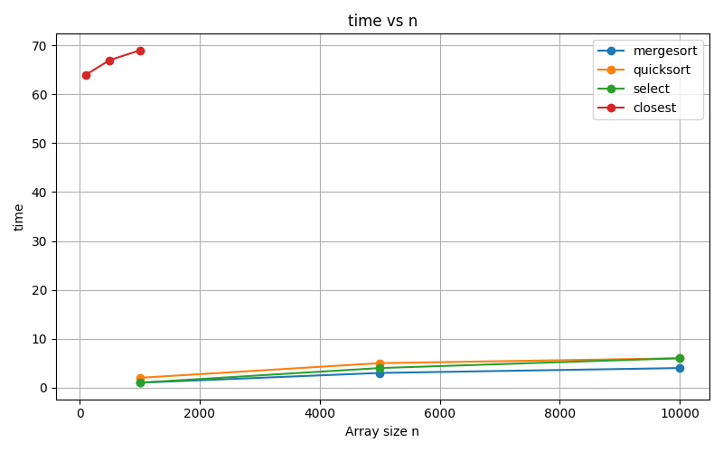
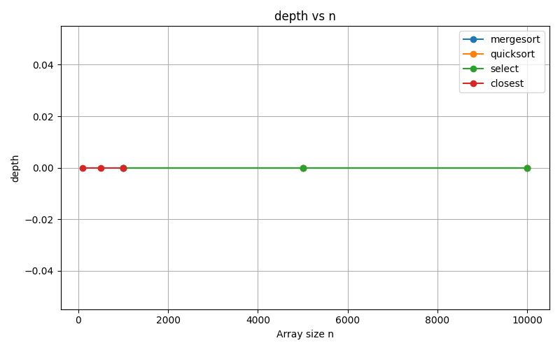
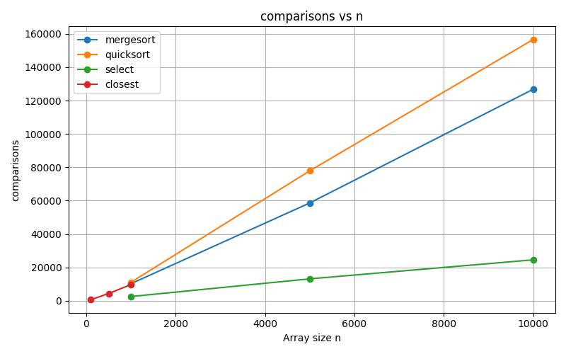
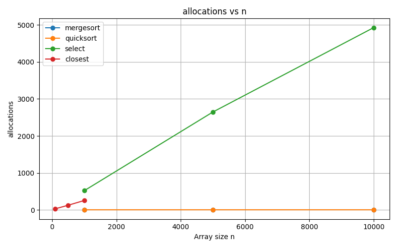

# Assignment 1 — Divide and Conquer Algorithms

## Overview

This project implements classic divide-and-conquer algorithms with safe recursion patterns, collects runtime metrics, and validates performance against theoretical bounds.

**Algorithms included:**

1. **MergeSort** (Master Case 2)
    - Linear merge
    - Reusable buffer
    - Small-n cutoff via insertion sort
2. **QuickSort** (robust)
    - Randomized pivot
    - Recurse on smaller partition, iterate on larger
    - Bounded stack ~ O(log n)
3. **Deterministic Select** (Median-of-Medians, O(n))
    - Groups of 5
    - Median-of-medians pivot
    - Recurse only into needed side
4. **Closest Pair of Points** (2D, O(n log n))
    - Sort by x
    - Recursive split
    - "Strip" check by y-order (7–8 neighbor scan)

---

## Architecture Notes

- **Recursion depth control:**
    - QuickSort always recurses on the smaller side
    - MergeSort uses a single reusable buffer
    - ClosestPair manages recursion depth with `strip` and direct array slices
- **Allocations:**
    - MergeSort: one buffer for merges
    - ClosestPair: temporary `strip` array
    - QuickSort/Select: in-place partitioning
- **Metrics collected:** time, comparisons, allocations, recursion depth

---

## Recurrence Analysis

| Algorithm | Recurrence | Complexity | Method |
|-----------|------------|------------|--------|
| MergeSort | T(n) = 2T(n/2) + Θ(n) | Θ(n log n) | Master Theorem Case 2 |
| QuickSort | T(n) = T(k) + T(n-k-1) + Θ(n) | Average Θ(n log n), Worst Θ(n²) | Master Theorem / Intuition |
| Deterministic Select | T(n) = T(n/5) + T(7n/10) + Θ(n) | Θ(n) | Median-of-Medians Analysis |
| Closest Pair | T(n) = 2T(n/2) + Θ(n) | Θ(n log n) | Classic D&C / Strip method |

---

## Metrics & Graphs

Metrics collected in `metrics.csv` with columns: algo,n,time,comparisons,allocations,depth

### Time vs n


### Recursion Depth vs n


### Comparisons vs n


### Allocations vs n


*Notes:* Small arrays may show overhead due to insertion sort or GC. Overall trends align with theoretical predictions.

---

## Testing

- **Sorting algorithms:** correctness verified against `Arrays.sort()` on random and adversarial arrays.
- **Deterministic Select:** compared with `Arrays.sort(arr)[k]` across 100 random trials.
- **Closest Pair:** fast D&C validated against O(n²) brute-force for n ≤ 2000.
- Edge cases: empty arrays, single-element arrays, duplicates, and small arrays handled correctly.

---

## CLI Usage

Run algorithms with size argument:

```bash
java -jar target/DAA_1-1.0-SNAPSHOT.jar --algo mergesort --size 10000
java -jar target/DAA_1-1.0-SNAPSHOT.jar --algo quicksort --size 50000
java -jar target/DAA_1-1.0-SNAPSHOT.jar --algo select --size 2000
java -jar target/DAA_1-1.0-SNAPSHOT.jar --algo closest --size 500